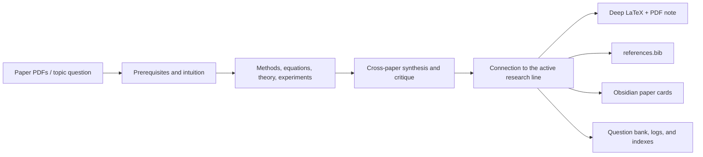

<div align="center">

# Research Note

**Turn papers into reusable Chinese research material—not disposable summaries.**

[](./SKILL.md)
[](#default-deliverables)
[](#default-deliverables)
[](#studyhub-configuration)
[](./LICENSE)

[中文](./README.md) · [Skill specification](./SKILL.md) · [Report an issue](https://github.com/PilgrimCh/research-note/issues)

</div>

`research-note` is a Codex skill for a Windows, LaTeX, and Obsidian-based academic reading workflow. It teaches the prerequisites, explains methods and equations, examines theory and experiments, compares related work, and closes with critique, research connections, and executable follow-up questions. Long papers and multi-paper tasks are not collapsed into a few pages of abstract-like prose.

## Workflow



## Default deliverables

A deep task aims to produce:

1. `deep_research_note.tex`
2. `deep_research_note.pdf`
3. `references.bib`
4. Obsidian / StudyHub paper cards
5. Relevant reading indexes, open questions, and research-log updates

Every new concept receives an intuitive explanation. Important equations include symbol definitions, assumptions, conclusions, and limitations. Experiment sections identify the data or environment, baselines, metrics, major findings, and the claim the authors intended to support.

## Example prompt

```text
Use $research-note to read these papers deeply. Do not write a short summary:
teach the prerequisites, explain the methods, equations, theory, and experiments,
then compare the papers critically and update my StudyHub.
```

Supported task styles include `Day N`, `专题 <topic>`, and `papers <pdf...>`. Brief mode is used only when explicitly requested.

## Depth modes

| Mode | When it applies | Target |
|---|---|---|
| Brief | Explicit request for a quick summary | 3–6 PDF pages |
| Standard | One short paper or ordinary reading | 8–12 PDF pages |
| Deep | Any paper over 20 pages, combined input over 40 pages, or summer-research / presentation material | 12–25 PDF pages; 4–6 substantive pages per paper in a synthesis |

## Installation

Clone the repository into your personal Codex skills directory:

```powershell
$skillDir = Join-Path $env:USERPROFILE ".codex\skills\research-note"
git clone https://github.com/PilgrimCh/research-note.git $skillDir
```

For an existing installation:

```powershell
git -C "$env:USERPROFILE\.codex\skills\research-note" pull
```

## StudyHub configuration

Your local vault path is never committed. Copy the example and set your absolute path:

```powershell
Copy-Item local-config.example.yaml local-config.yaml
```

```yaml
studyhub_root: 'D:\path\to\StudyHub'
```

`local-config.yaml` is ignored by Git. The skill resolves StudyHub from: an explicit path in the current request, local config, the `STUDYHUB_ROOT` environment variable, or—if none exists—a user question before any vault write.

## Clean workspace contract

When a project directory is provided, the root stays small:

```text
project-root/
├── <user-provided-paper.pdf>
├── final_deliverables/      # files a user will open or submit
└── intermediate_files/      # extraction, LaTeX, BibTeX, and render checks
```

## Windows LaTeX protocol

Chinese filenames are compiled with an ASCII job name to avoid Biber encoding failures:

```powershell
xelatex -jobname=deep_note -interaction=nonstopmode "<Chinese filename>.tex"
biber deep_note
xelatex -jobname=deep_note -interaction=nonstopmode "<Chinese filename>.tex"
xelatex -jobname=deep_note -interaction=nonstopmode "<Chinese filename>.tex"
```

Before delivery, the workflow checks page count, citations, bibliography, fatal errors, and severe overfull boxes, then renders representative pages for visual QA.

## Repository map

```text
research-note/
├── SKILL.md                    # depth, content, layout, and QA contract
├── agents/openai.yaml          # Codex UI metadata
├── assets/template.tex         # Chinese research-note LaTeX template
├── references/
│   ├── box-guide.md
│   └── cite-guide.md
└── local-config.example.yaml   # publishable local configuration example
```

## Boundaries

- Output is Chinese by default; technical terms may retain English glosses.
- Personalized research connections depend on the user's own StudyHub context.
- PDF delivery requires XeLaTeX, Biber, and Poppler; missing tools are reported explicitly.
- Local configuration and personal research content should never be committed to this public repository.

Contributions that improve the LaTeX template, citation handling, synthesis structure, or Windows compatibility are welcome.

## License

[MIT](./LICENSE)
