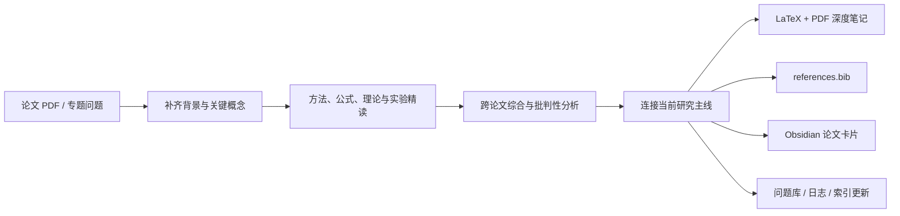

<div align="center">

# Research Note

**把论文变成可复用的中文研究材料，而不是一次性摘要。**

[](./SKILL.md)
[](#核心产出)
[](#核心产出)
[](#studyhub-配置)
[](./LICENSE)

[English](./README.en.md) · [Skill 规范](./SKILL.md) · [反馈问题](https://github.com/PilgrimCh/research-note/issues)

</div>

`research-note` 是一个面向 Codex、Windows、LaTeX 和 Obsidian 工作流的研究阅读 skill。它从背景概念讲起，进入方法、公式、理论、实验和横向对比，再以批判性分析、研究连接与可执行问题收束。长论文和多论文任务不会被压缩成几页“摘要 + 优缺点”。

## 工作流



## 核心产出

默认的深度任务会尽可能交付：

1. `deep_research_note.tex`
2. `deep_research_note.pdf`
3. `references.bib`
4. Obsidian / StudyHub 论文卡片
5. 与研究主线相关的索引、开放问题和研究日志更新

每个新概念需要直觉解释；关键公式需要解释符号、假设、结论与局限；实验部分需要写清数据或环境、baseline、metric、主要发现以及作者试图证明什么。

## 适合怎样调用

```text
使用 $research-note 深度精读这篇论文。不要只做摘要：先补背景概念，再解释方法、
关键公式、理论与实验，最后做批判性分析，并写入我的 StudyHub。
```

也可以直接使用这些任务形式：

- `Day N`：生成当天研究阅读与日志。
- `专题 <主题>`：从基础到前沿组织专题笔记。
- `papers <pdf...>`：进行多论文精读和综合。
- `brief`：只有显式要求时才压缩到 3–6 页。

## 深度模式

| 模式 | 适用情形 | 目标输出 |
|---|---|---|
| Brief | 用户明确要求快速、简短 | 3–6 页 PDF |
| Standard | 单篇短论文或普通阅读 | 8–12 页 PDF |
| Deep | 任一论文超过 20 页、多篇合计超过 40 页，或需要暑研 / presentation 材料 | 12–25 页 PDF；多论文时每篇至少 4–6 页实质内容 |

## 安装

将仓库克隆到个人 Codex skills 目录：

```powershell
$skillDir = Join-Path $env:USERPROFILE ".codex\skills\research-note"
git clone https://github.com/PilgrimCh/research-note.git $skillDir
```

如果已经安装：

```powershell
git -C "$env:USERPROFILE\.codex\skills\research-note" pull
```

## StudyHub 配置

这个仓库不会提交你的本地 vault 路径。复制示例配置，然后填写自己的绝对路径：

```powershell
Copy-Item local-config.example.yaml local-config.yaml
```

```yaml
studyhub_root: 'D:\path\to\StudyHub'
```

`local-config.yaml` 已被 Git 忽略。skill 按以下顺序解析 StudyHub：

1. 当前请求中显式提供的 vault 路径；
2. `local-config.yaml`；
3. `STUDYHUB_ROOT` 环境变量；
4. 都不存在时询问用户，不会猜测写入位置。

## 输出目录约定

给出项目目录后，skill 会保持根目录干净：

```text
project-root/
├── <用户提供的原始论文.pdf>
├── final_deliverables/      # 只放最终可打开或可提交的成品
└── intermediate_files/      # 文本抽取、LaTeX、BibTeX、渲染检查等
```

这样可以避免 `.aux`、`.log`、页面 PNG、临时脚本和旧版本散落在研究项目根目录。

## LaTeX 与视觉验证

中文文件名在 Windows 上容易引发 Biber 编码问题，因此使用 ASCII job name：

```powershell
xelatex -jobname=deep_note -interaction=nonstopmode "<中文文件名>.tex"
biber deep_note
xelatex -jobname=deep_note -interaction=nonstopmode "<中文文件名>.tex"
xelatex -jobname=deep_note -interaction=nonstopmode "<中文文件名>.tex"
```

交付前还会检查页数、引用、bibliography、严重 overfull box，并渲染首页、前几页和末页做视觉 QA。

## 仓库结构

```text
research-note/
├── SKILL.md                    # 深度、内容、目录与验证契约
├── agents/openai.yaml          # Codex UI 元数据
├── assets/template.tex         # 中文研究笔记 LaTeX 模板
├── references/
│   ├── box-guide.md            # tcolorbox 使用说明
│   └── cite-guide.md           # 引用与参考文献说明
└── local-config.example.yaml   # 可公开的本机配置示例
```

## 边界

- 默认输出中文，术语可保留英文括注。
- StudyHub 的研究主线连接需要依赖用户自己的 vault 上下文。
- PDF 交付依赖本机可用的 XeLaTeX、Biber 和 Poppler；若环境缺失，skill 会明确报告跳过了什么。
- 本地配置和个人研究内容不应提交到这个公共仓库。

欢迎贡献更稳健的 LaTeX 模板、引用处理、跨论文综合结构和 Windows 兼容性改进。

## License

[MIT](./LICENSE)
